# End-to-End Flow — Interview Prep Application

Example topic used throughout: **Data Engineering** (with optional sub-topics).

---

## 1. System overview

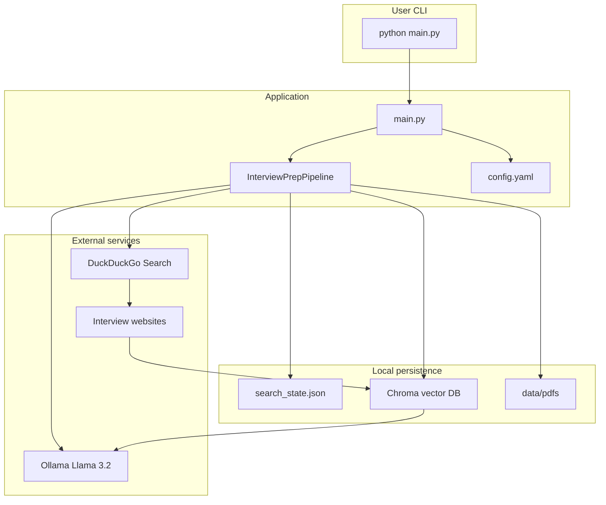

---

## 2. Decision flow (every run)

When you run the app, it first decides **whether to hit the internet**.

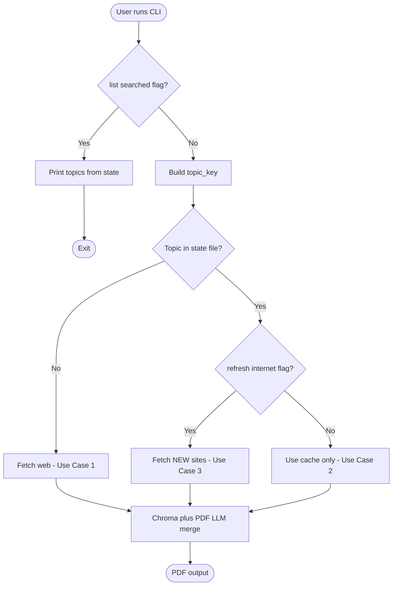

| Condition | Web? | Source of content |
|-----------|------|-------------------|
| First time for topic | Yes | DuckDuckGo → scrape → Chroma |
| Topic exists, no `--refresh-internet` | No | Chroma + existing PDF |
| Topic exists + `--refresh-internet` | Yes (new URLs only) | New sites → append Chroma + merge with PDF |

---

## 3. Detailed pipeline (web fetch path)

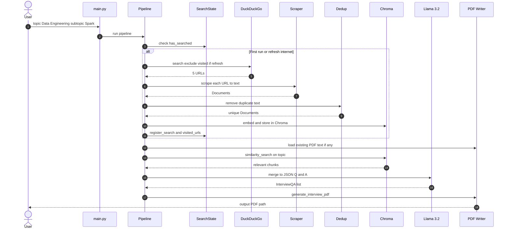

---

## 4. Use cases — Data Engineering

### Use Case 1 — First-time topic (web + new PDF)

**Goal:** User wants interview questions for Data Engineering for the first time.

```bash
python main.py --topic "Data Engineering" --num-sites 5
```

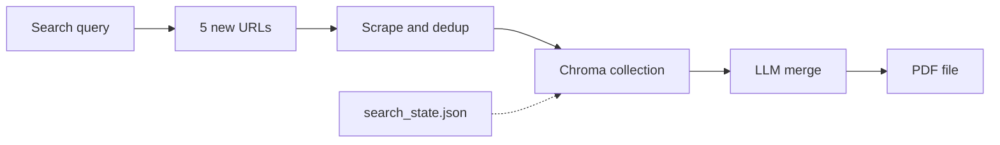

**What happens**

1. DuckDuckGo returns 5 sites (e.g. GeeksforGeeks, InterviewBit, Medium, etc.).
2. Text extracted, near-duplicates removed (~85% similarity threshold).
3. Chunks embedded (Llama 3.2 embeddings) and stored in Chroma.
4. LLM produces structured Q&A: Level | Question | Answer | Source.
5. PDF saved; state records topic + visited URLs.

**Sample PDF block**

| Field | Example |
|-------|---------|
| Level | Medium |
| Question | What is the difference between ETL and ELT? |
| Answer | ETL transforms before load; ELT loads raw data first… |
| Source | https://example.com/data-engineering-interview |

---

### Use Case 2 — Same topic, offline / fast regenerate (cache only)

**Goal:** User already ran once; wants an updated PDF without waiting for web or using Ollama only on merge.

```bash
python main.py --topic "Data Engineering"
```

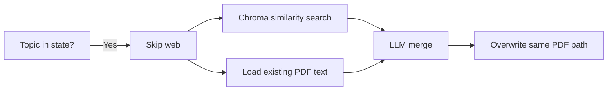

**What happens**

- No HTTP to interview sites.
- Retrieves best-matching chunks from Chroma for `"Data Engineering interview questions..."`.
- Reads prior PDF from `data/pdfs/data-engineering.pdf` if present.
- LLM deduplicates and reformats → new PDF at same path.

**When to use:** Quick refresh of formatting, tweak LLM output, or re-run after fixing Ollama — without new content.

---

### Use Case 3 — Sub-topic (narrower scope)

**Goal:** Focus on Apache Spark within Data Engineering.

```bash
python main.py --topic "Data Engineering" --subtopic "Apache Spark" --num-sites 5
```

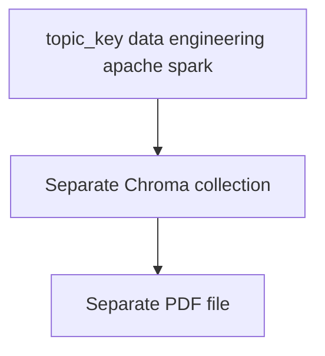

**Note:** Sub-topic is a **different cache key** from the parent topic. Parent and sub-topic each have their own Chroma collection, state entry, and PDF.

---

### Use Case 4 — Refresh internet (new websites + append)

**Goal:** User finished first PDF; wants **more questions from new sources**, merged into one PDF.

```bash
python main.py --topic "Data Engineering" --subtopic "Apache Spark" \
  --refresh-internet --num-sites 5
```

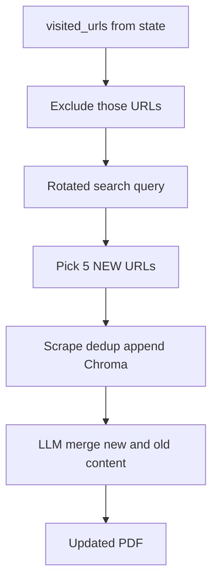

**What happens**

1. Skips all URLs in `visited_urls` for that topic.
2. Uses alternate search phrasing (rotates each `search_count`).
3. Appends new chunks to existing Chroma collection (does not wipe old data).
4. LLM merges old PDF + new web content without duplicate questions.
5. Adds new URLs to `visited_urls`.

---

### Use Case 5 — Refresh but no new sites left

**Goal:** User runs `--refresh-internet` again but search has no unseen URLs.

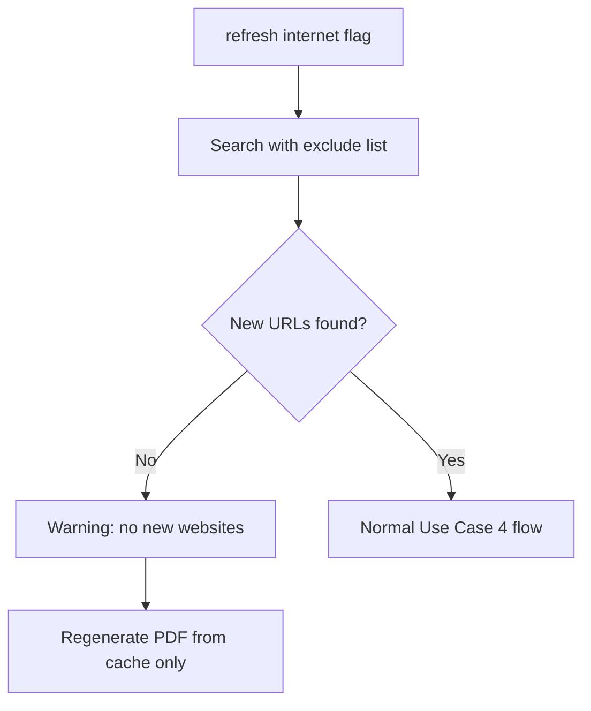

---

### Use Case 6 — List all prepared topics

```bash
python main.py --list-searched
```

**Example output**

```
data engineering | PDF: data/pdfs/data-engineering.pdf | web searches: 1 | last: 2026-05-23T...
data engineering::apache spark | PDF: .../data-engineering_apache-spark.pdf | web searches: 2 | ...
```

---

### Use Case 7 — Custom config / paths

**Goal:** Store PDFs on an external drive; use a different Ollama model.

Edit `config.yaml` or env vars, then run as usual:

```bash
python main.py --topic "Data Engineering" --config /path/to/config.yaml
```

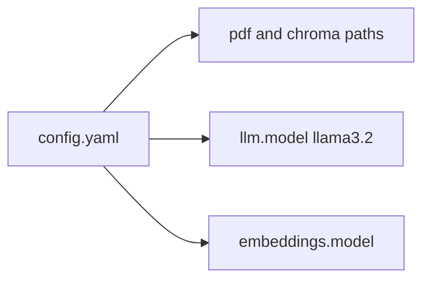

---

## 5. Data Engineering — example journey (all use cases)

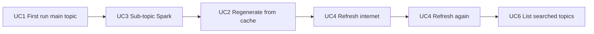

| Step | Command | Result |
|------|---------|--------|
| 1 | `python main.py -t "Data Engineering" -n 5` | First PDF + Chroma + 5 URLs in state |
| 2 | `python main.py -t "Data Engineering" -s "Apache Spark" -n 5` | Separate Spark PDF + cache |
| 3 | `python main.py -t "Data Engineering"` | PDF regenerated from cache (no web) |
| 4 | `python main.py -t "Data Engineering" --refresh-internet -n 5` | 5 **new** sites, merged PDF |
| 5 | `python main.py --list-searched` | See both topics and search counts |

---

## 6. Component map

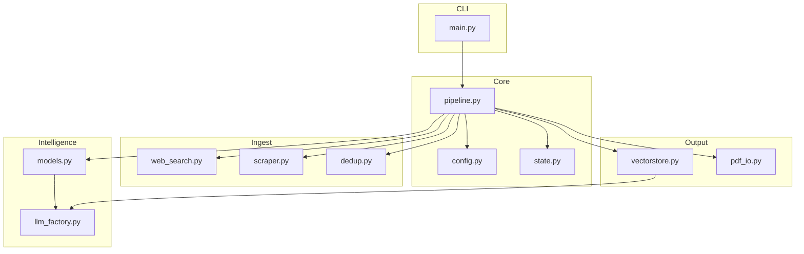

---

## 7. PDF output structure

Every generated PDF follows this repeating block:

```
┌─────────────────────────────────────────┐
│ Interview Questions: Data Engineering   │
│              — Apache Spark             │
├─────────────────────────────────────────┤
│ Question 1 — Level: Easy                │
│ Question                                │
│   What is RDD?                          │
│ Answer                                  │
│   Resilient Distributed Dataset is...   │
│ Source                                  │
│   https://...                           │
├─────────────────────────────────────────┤
│ Question 2 — Level: Hard                │
│ ...                                     │
└─────────────────────────────────────────┘
```

---

## 8. Files on disk (after Use Case 1 + 3)

```
data/
├── search_state.json          # topics, visited_urls, search_count
├── chroma/                    # persisted embeddings
│   └── (collections per topic_key)
└── pdfs/
    ├── data-engineering.pdf
    └── data-engineering_apache-spark.pdf
```

---

## 9. Prerequisites checklist

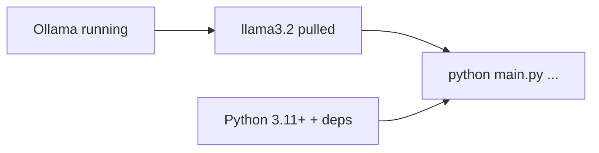

```bash
ollama pull llama3.2
ollama serve
uv sync
python main.py --topic "Data Engineering" --num-sites 5
```

---

## 10. Quick reference

| Intent | Flags |
|--------|-------|
| New topic, fetch web | `--topic "Data Engineering" -n 5` |
| Sub-topic | add `--subtopic "Apache Spark"` |
| No web, use cache | same topic, **no** `--refresh-internet` |
| New websites only | `--refresh-internet -n 5` |
| See history | `--list-searched` |
