# End-to-End Flow — Interview Prep Application

Example topic used throughout: **Data Engineering / PySpark**.

This document reflects the **current implementation**, where:

- the **Q&A JSON store** is the source of truth
- the **PDF is export only**
- refresh runs process **new sites only**
- question dedupe happens **across all refreshes**

---

## 1. System overview

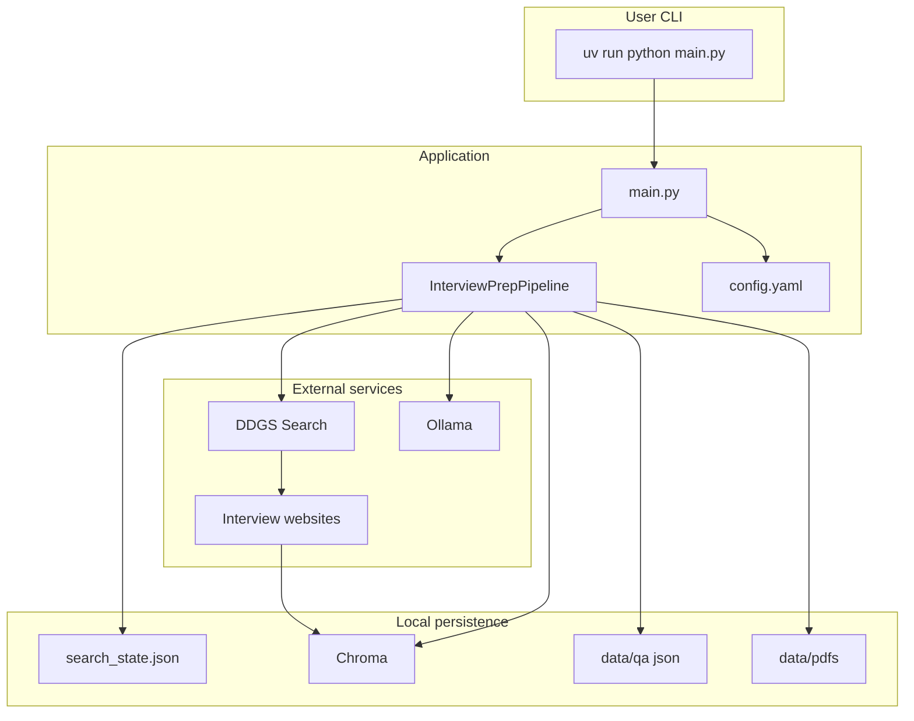

---

## 2. High-level design change

### Old approach

```text
web + old PDF + old cache -> one large LLM merge -> PDF
```

Problems:

- prompt grows after each refresh
- duplicate questions slip through
- long runs become slow and unstable

### New approach

```text
new web batch only -> bounded LLM extract -> dedupe vs Q&A store -> save JSON -> export PDF
```

Benefits:

- bounded LLM work per refresh
- no need to re-read old PDF
- cache-only runs skip LLM entirely

---

## 3. Decision flow (every run)

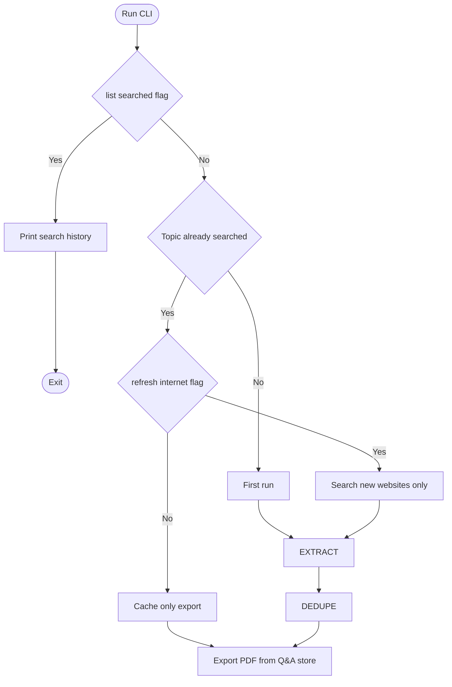

| Condition | Web? | LLM? | Main source |
|-----------|------|------|-------------|
| First run | Yes | Yes | New scraped batch |
| Refresh | Yes | Yes | New scraped batch only |
| Cache-only | No | No | Existing `data/qa/*.json` |

---

## 4. Detailed runtime flow

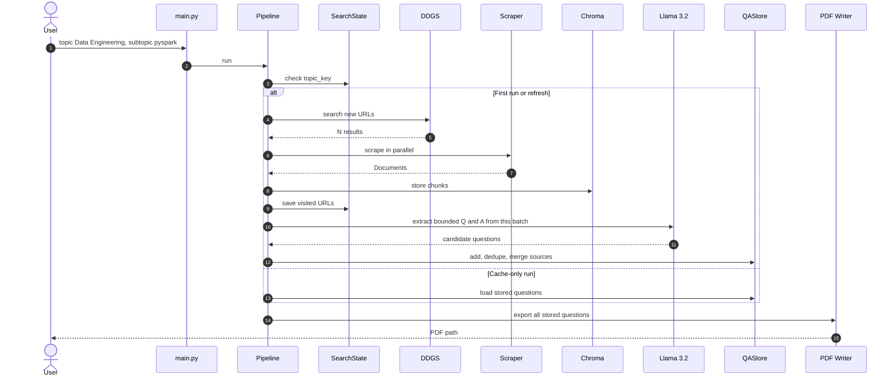

---

## 5. Key data stores

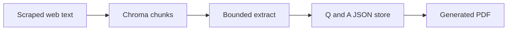

### Responsibilities

| Store | Purpose |
|------|---------|
| `search_state.json` | search history, visited URLs, refresh count |
| `data/chroma/` | source text chunks for retrieval and migration |
| `data/qa/*.json` | canonical question bank |
| `data/pdfs/*.pdf` | export artifact only |

---

## 6. Use cases — Data Engineering / PySpark

### Use Case 1 — First run

```bash
uv run python main.py --topic "Data Engineering" --subtopic "pyspark" -n 3
```


What happens:

1. Search up to 3 sites.
2. Scrape with multiple workers.
3. Store chunks in Chroma.
4. Extract a bounded number of questions from this batch.
5. Save only unique questions into the Q&A store.
6. Export PDF from the full store.

---

### Use Case 2 — Cache-only export

```bash
uv run python main.py --topic "Data Engineering" --subtopic "pyspark"
```


What happens:

- no web search
- no scraping
- no extraction LLM
- very fast PDF regeneration

This is the preferred run when content already exists and you only need the PDF again.

---

### Use Case 3 — Refresh with new websites only

```bash
uv run python main.py --topic "Data Engineering" --subtopic "pyspark" --refresh-internet -n 3
```

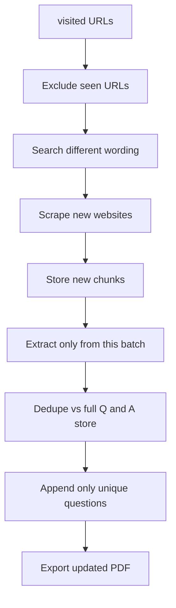

What happens:

1. URLs already seen are excluded.
2. New search wording is rotated.
3. Only the new batch is sent to the extraction LLM.
4. New questions are deduped against all historical questions.
5. PDF is regenerated from the updated Q&A store.

---

### Use Case 4 — No new URLs found

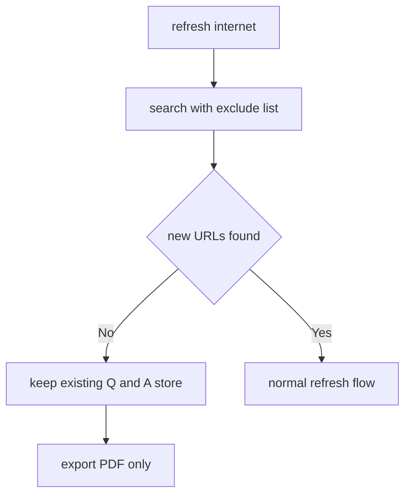

---

### Use Case 5 — Embedding model changed

Example: previous Chroma built with `llama3.2`, current config uses `nomic-embed-text`.

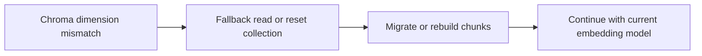

What happens in the app:

- migration path can read stored chunks directly
- new inserts can reset that topic's Chroma collection when dimensions differ
- the Q&A store remains the stable source of truth

---

## 7. How duplicate questions are prevented

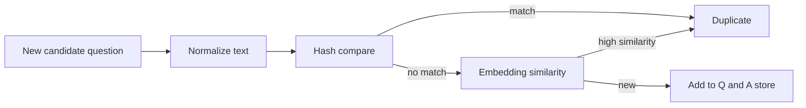

When a duplicate is found:

- sources are merged
- the better / longer answer can replace the old one
- only one canonical question stays in the store

This works across the first refresh and the nth refresh, even when websites are different.

---

## 8. Performance constraints and tuning

### Recommended operating point

| Run type | Recommended setting |
|---------|---------------------|
| First run | `-n 3` |
| Refresh | `--refresh-internet -n 3` |
| Faster refresh | `--refresh-internet -n 2` |
| Cache-only | omit `--refresh-internet` |

### Why this usually stays near 3 minutes

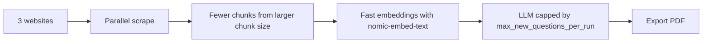

Settings that support this:

- `web.scrape_workers: 3`
- `web.request_timeout_seconds: 15`
- `vectorstore.chunk_size: 2000`
- `pipeline.max_context_chars: 6000`
- `pipeline.max_new_questions_per_run: 10`
- `embeddings.model: nomic-embed-text`

---

## 9. Example journey

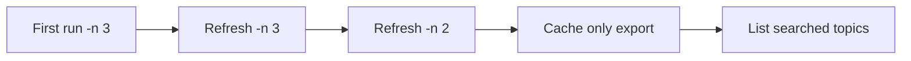

| Step | Command | Result |
|------|---------|--------|
| 1 | `uv run python main.py -t "Data Engineering" -s "pyspark" -n 3` | first Q&A store + PDF |
| 2 | `uv run python main.py -t "Data Engineering" -s "pyspark" --refresh-internet -n 3` | adds only unique new questions |
| 3 | `uv run python main.py -t "Data Engineering" -s "pyspark" --refresh-internet -n 2` | smaller bounded refresh |
| 4 | `uv run python main.py -t "Data Engineering" -s "pyspark"` | fast PDF export from store |
| 5 | `uv run python main.py --list-searched` | inspect search history |

---

## 10. Component map

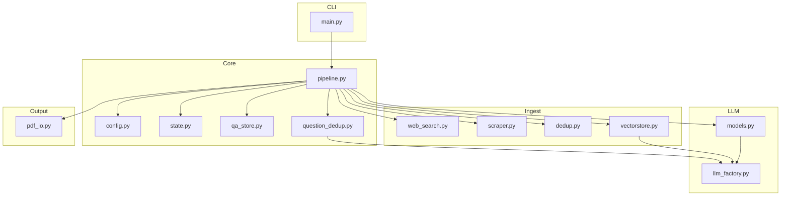

---

## 11. Files on disk

```text
data/
├── chroma/
│   └── chroma.sqlite3
├── pdfs/
│   └── data-engineering_pyspark.pdf
├── qa/
│   └── data-engineering_pyspark.json
└── search_state.json
```

---

## 12. Prerequisites checklist

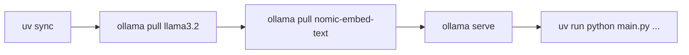

```bash
cd ~
uv sync
ollama pull llama3.2
ollama pull nomic-embed-text
ollama serve
cd Desktop/sourav
uv run python main.py --topic "Data Engineering" --subtopic "pyspark" -n 3
```

---

## 13. Quick reference

| Intent | Command shape |
|--------|---------------|
| First run | `-t TOPIC -s SUBTOPIC -n 3` |
| Refresh from new sites | `-t TOPIC -s SUBTOPIC --refresh-internet -n 3` |
| Faster refresh | `--refresh-internet -n 2` |
| Cache-only export | same topic, no refresh flag |
| List topic history | `--list-searched` |
